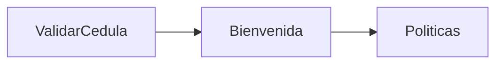

## Overview

The `Bienvenida` component displays a personalized welcome message with employee information and automatically transitions to the policies screen after 3.5 seconds.

**Route:** `/bienvenida`

## Component Purpose

- Displays personalized welcome message with employee name
- Shows employee photo, job title, and area
- Displays entry date and time
- Auto-navigates to policies screen

## Props via Location State

<ParamField path="datosEmpleado" type="object" required>
  Employee data received from the ValidarCedula component.
  
  **Structure:**
  ```javascript
  {
    nombre: string,
    foto: string | null,
    cargo: string,
    area_nombre: string
  }
  ```
</ParamField>

<ParamField path="fechaHoraIngreso" type="string (ISO)" required>
  ISO timestamp of when the employee entered their ID.
</ParamField>

## State Management

The component uses `useMemo` hooks for efficient data processing:

### datosEmpleado
```javascript
const datosEmpleado = useMemo(
  () => location.state?.datosEmpleado ?? {},
  [location.state?.datosEmpleado]
);
```

### Date Formatting
```javascript
const { horaIngreso, fechaFormateada } = useMemo(() => {
  if (!fechaHoraIngreso) {
    return {
      fechaFormateada: "No disponible",
      horaIngreso: "No disponible",
    };
  }

  const fecha = new Date(fechaHoraIngreso);
  return {
    fechaFormateada: fecha.toLocaleDateString("es-CO", {
      year: "numeric",
      month: "long",
      day: "numeric",
    }),
    horaIngreso: fecha.toLocaleTimeString("es-CO", {
      hour: "2-digit",
      minute: "2-digit",
    }),
  };
}, [fechaHoraIngreso]);
```

## Auto-Navigation

The component automatically navigates to the policies screen after 3.5 seconds:

```javascript Auto-navigation Effect
useEffect(() => {
  const timer = setTimeout(() => {
    navigate("/politicas", { state: { datosEmpleado } });
  }, 3500);

  return () => clearTimeout(timer);
}, [navigate, datosEmpleado]);
```

<Note>
  The timer is properly cleaned up when the component unmounts to prevent memory leaks.
</Note>

## UI Features

### Profile Photo Display

<Tabs>
  <Tab title="With Photo">
    Displays the employee's photo from the BUK API
    ```jsx
    
    ```
  </Tab>
  <Tab title="Placeholder">
    Shows a User icon placeholder when photo is unavailable
    ```jsx
    <div className="bienvenida-foto-placeholder">
      <User size={32} color="#92614F" strokeWidth={2} />
    </div>
    ```
  </Tab>
</Tabs>

### Personalized Greeting

Extracts the first name from the full name:
```javascript
<h1 className="bienvenida-saludo">
  ¡Hola, {datosEmpleado.nombre?.split(" ")[0]}!
</h1>
```

### Information Display

- **Job Title & Area**: Displays cargo and area_nombre
- **Date & Time**: Shows formatted entry date and time with icons

## Icons Used

- **Calendar** (`lucide-react`): For date display
- **Clock** (`lucide-react`): For time display
- **User** (`lucide-react`): For photo placeholder

## Navigation Flow



**State Passed Forward:**
- `datosEmpleado`: Employee object (preserved for entire flow)

## Code Example

<CodeGroup>
```jsx Component Structure
const Bienvenida = () => {
  const navigate = useNavigate();
  const location = useLocation();
  const datosEmpleado = useMemo(
    () => location.state?.datosEmpleado ?? {},
    [location.state?.datosEmpleado]
  );
  const fechaHoraIngreso = location.state?.fechaHoraIngreso;

  // Auto-navigate after 3.5 seconds
  useEffect(() => {
    const timer = setTimeout(() => {
      navigate("/politicas", { state: { datosEmpleado } });
    }, 3500);

    return () => clearTimeout(timer);
  }, [navigate, datosEmpleado]);

  return (
    <div className="page-wrapper">
      <div className="bienvenida-card">
        {/* Profile photo */}
        {/* Greeting */}
        {/* Employee info */}
        {/* Date and time */}
      </div>
    </div>
  );
};
```
</CodeGroup>

## Related Components

- [ValidarCedula](/api/validar-cedula) - Previous step
- [Salas](/api/salas) - After policies screen
- [Reservas](/api/reservas) - Final booking step