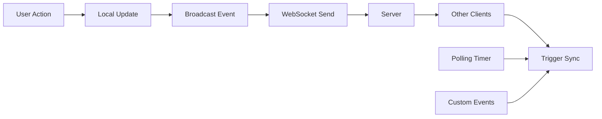

## Overview

The Crepes & Waffles Coworking system uses a multi-layered synchronization strategy to keep reservation data in sync across all connected clients:

1. **WebSocket** - Primary real-time sync mechanism
2. **Custom Events** - Local browser event broadcasting
3. **Polling** - Fallback mechanism for reliability

<Note>
  The `useRealtimeSync` hook automatically manages all three sync mechanisms. You don't need to manually coordinate them.
</Note>

## Architecture



## WebSocket Configuration

### Connection Setup

The WebSocket connection is automatically established when `VITE_RESERVAS_WS_URL` is configured:

<ParamField path="VITE_RESERVAS_WS_URL" type="string">
  WebSocket server endpoint for reservation updates.
  
  **Example:**
  ```bash
  VITE_RESERVAS_WS_URL=wss://macfer.crepesywaffles.com/ws/reservas
  ```
</ParamField>

### Connection Lifecycle

<Steps>
  <Step title="Auto-connect on mount">
    When the component using `useRealtimeSync` mounts, the hook automatically attempts to connect.
    
    ```javascript
    const { triggerSync, notifyChange } = useRealtimeSync(handleSync);
    // Connection established automatically
    ```
  </Step>
  
  <Step title="Connection established">
    On successful connection, you'll see:
    ```
    ✅ WebSocket conectado para reservas
    ```
  </Step>
  
  <Step title="Auto-reconnect on disconnect">
    If the connection drops, exponential backoff reconnection is attempted:
    - 1st attempt: 2 seconds
    - 2nd attempt: 4 seconds
    - 3rd attempt: 8 seconds
    - Max delay: 15 seconds
    
    **Source:** `src/hooks/useRealtimeSync.js:111-117`
  </Step>
</Steps>

### Connection Constants

<CodeGroup>
```javascript Constants
// WebSocket URL from environment
const WS_URL = import.meta.env.VITE_RESERVAS_WS_URL || '';

// Polling fallback interval (default: 30 seconds)
const POLLING_MS = Number(import.meta.env.VITE_RESERVAS_POLLING_MS || 30000);

// Maximum reconnection delay (15 seconds)
const MAX_RECONNECT_MS = 15000;
```

```javascript Exponential Backoff
// Reconnection delay calculation
const delay = Math.min(
  1000 * (2 ** reconnectAttemptRef.current),
  MAX_RECONNECT_MS
);

// Reset on successful connection
ws.onopen = () => {
  reconnectAttemptRef.current = 0;
  console.log('✅ WebSocket conectado para reservas');
};
```
</CodeGroup>

## Message Protocol

### Incoming Messages

The system recognizes reservation updates from various message formats:

<ParamField path="payload.event" type="string">
  Primary event identifier. Matches:
  - `working-reservas-updated`
  - `reservas-updated`
  - `reserva`
</ParamField>

<ParamField path="payload.model" type="string">
  Resource type. Matches:
  - `working-reserva`
  - `working-reservas`
  - `reserva`
</ParamField>

<ParamField path="payload.data" type="object">
  Payload data, searched for reservation-related keywords.
</ParamField>

### Message Detection Logic

The system uses fuzzy matching to detect reservation updates:

```javascript
const shouldSyncFromSocketPayload = (payload) => {
  const eventText = normalizeText(payload.event || payload.type);
  const modelText = normalizeText(payload.model || payload.collection);
  const dataText = normalizeText(JSON.stringify(payload.data));
  const fullText = `${eventText} ${modelText} ${dataText}`;

  return (
    fullText.includes('working-reservas-updated') ||
    fullText.includes('reservas-updated') ||
    fullText.includes('working-reserva') ||
    fullText.includes('reserva')
  );
};
```

<Accordion title="Supported Message Formats">
  **JSON format:**
  ```json
  {
    "event": "working-reservas-updated",
    "model": "reserva",
    "data": { "id": 123, "estado": "Confirmada" }
  }
  ```
  
  **Alternative format:**
  ```json
  {
    "type": "reservas-updated",
    "collection": "working-reservas",
    "payload": { "reservaId": 456 }
  }
  ```
  
  **Plain text format:**
  ```
  working-reserva:updated:789
  ```
</Accordion>

### Outgoing Messages

When local changes occur, the system broadcasts to other clients:

```javascript
const { notifyChange } = useRealtimeSync(handleSync);

// After updating a reservation
await updateReservation(reservaId, data);
notifyChange(); // Broadcast to other clients
```

Message sent:
```json
{
  "event": "working-reservas-updated",
  "source": "client",
  "timestamp": 1710380400000
}
```

## Custom Events

The system uses browser custom events for local synchronization:

### Event Types

<ParamField path="reservas-updated" type="CustomEvent">
  General reservation update event.
  
  ```javascript
  window.addEventListener('reservas-updated', handleSync);
  window.dispatchEvent(new CustomEvent('reservas-updated'));
  ```
</ParamField>

<ParamField path="working-reservas-updated" type="CustomEvent">
  Coworking-specific reservation update.
  
  ```javascript
  window.addEventListener('working-reservas-updated', handleSync);
  window.dispatchEvent(new CustomEvent('working-reservas-updated'));
  ```
</ParamField>

### Usage Example

<CodeGroup>
```javascript Component A (Updater)
import { useRealtimeSync } from '../hooks/useRealtimeSync';

function ReservationForm() {
  const { notifyChange } = useRealtimeSync();
  
  const handleSubmit = async (data) => {
    await api.updateReservation(data);
    notifyChange(); // Notify other components
  };
  
  return <form onSubmit={handleSubmit}>...</form>;
}
```

```javascript Component B (Listener)
import { useRealtimeSync } from '../hooks/useRealtimeSync';

function ReservationList() {
  const [reservations, setReservations] = useState([]);
  
  const handleSync = useCallback(() => {
    // Refetch reservations
    fetchReservations().then(setReservations);
  }, []);
  
  useRealtimeSync(handleSync);
  
  return <div>{/* Render reservations */}</div>;
}
```
</CodeGroup>

## Polling Configuration

### Polling Interval

<ParamField path="VITE_RESERVAS_POLLING_MS" type="number" default={30000}>
  Fallback polling interval in milliseconds.
  
  **Recommended values:**
  - Development: `15000` (15 seconds) - Faster feedback
  - Production: `30000` (30 seconds) - Balanced
  - Low-traffic: `60000` (60 seconds) - Reduced load
</ParamField>

### How Polling Works

<Steps>
  <Step title="Timer initialization">
    Polling timer starts when component mounts:
    ```javascript
    setInterval(() => {
      const timeSinceLastSync = Date.now() - lastSyncRef.current;
      
      if (timeSinceLastSync > POLLING_MS - 5000) {
        console.log('⏰ Sincronización automática (polling)');
        triggerSync('polling');
      }
    }, POLLING_MS);
    ```
  </Step>
  
  <Step title="Sync check">
    Every `POLLING_MS`, the hook checks if a sync is needed based on time since last sync.
  </Step>
  
  <Step title="Smart polling">
    Polling only triggers if no other sync source (WebSocket, events) has fired recently.
    
    This prevents redundant syncs when WebSocket is active.
  </Step>
</Steps>

### Disable Polling

To rely solely on WebSocket/events:

```bash
# Set to a very high value (1 hour)
VITE_RESERVAS_POLLING_MS=3600000
```

<Warning>
  Disabling polling removes the fallback mechanism. Only do this if you have a highly reliable WebSocket connection.
</Warning>

## Sync Debouncing

The system includes built-in debouncing to prevent excessive syncs:

```javascript
const triggerSync = useCallback((source = 'manual') => {
  if (syncDebounceRef.current) {
    clearTimeout(syncDebounceRef.current);
  }

  syncDebounceRef.current = setTimeout(() => {
    console.log(`🔄 Sincronización disparada desde: ${source}`);
    if (onSync) {
      onSync();
    }
    lastSyncRef.current = Date.now();
  }, 120); // 120ms debounce
}, [onSync]);
```

<Note>
  If multiple sync triggers occur within 120ms, only the last one executes. This prevents sync storms.
</Note>

## Usage Guide

### Basic Implementation

```javascript
import { useCallback } from 'react';
import useRealtimeSync from '../hooks/useRealtimeSync';
import { fetchReservations } from '../api/reservations';

function ReservationManager() {
  const [reservations, setReservations] = useState([]);
  
  // Define sync handler
  const handleSync = useCallback(async () => {
    console.log('Syncing reservations...');
    const data = await fetchReservations();
    setReservations(data);
  }, []);
  
  // Setup real-time sync
  const { triggerSync, notifyChange } = useRealtimeSync(handleSync);
  
  // Manually trigger sync if needed
  const handleRefresh = () => {
    triggerSync('manual');
  };
  
  // Notify after local changes
  const handleUpdate = async (id, updates) => {
    await updateReservation(id, updates);
    notifyChange(); // Broadcast to other clients
  };
  
  return (
    <div>
      <button onClick={handleRefresh}>Refresh</button>
      {/* Render reservations */}
    </div>
  );
}
```

### Advanced: Multiple Sync Sources

```javascript
const handleSync = useCallback(async (source) => {
  console.log(`Sync triggered by: ${source}`);
  
  // Different behavior based on source
  switch (source) {
    case 'websocket-message':
      // Full sync for WebSocket updates
      await fullDataSync();
      break;
      
    case 'polling':
      // Incremental sync for polling
      await incrementalSync();
      break;
      
    case 'custom-event':
      // Light refresh for local events
      await quickRefresh();
      break;
  }
}, []);

const { triggerSync, notifyChange } = useRealtimeSync(handleSync);
```

## Monitoring and Debugging

### Console Logs

The sync system provides detailed console logs:

| Log | Meaning |
|-----|--------|
| `✅ WebSocket conectado para reservas` | WebSocket connected successfully |
| `⚠️ Error en WebSocket de reservas:` | WebSocket error occurred |
| `🔁 WebSocket desconectado. Reintentando en Xs...` | Reconnecting after disconnect |
| `🔄 Sincronización disparada desde: [source]` | Sync triggered from source |
| `⏰ Sincronización automática (polling)` | Polling triggered sync |
| `ℹ️ WebSocket no configurado` | WebSocket URL not set |
| `✅ Notificación de cambio enviada` | Change notification sent |

### Debug Mode

Add detailed logging:

```javascript
const handleSync = useCallback((source) => {
  console.group(`🔄 Sync from ${source}`);
  console.log('Timestamp:', new Date().toISOString());
  console.log('Last sync:', new Date(lastSyncRef.current).toISOString());
  console.log('WebSocket state:', wsRef.current?.readyState);
  
  // Perform sync
  fetchData().then(() => {
    console.log('✅ Sync completed');
    console.groupEnd();
  });
}, []);
```

## Troubleshooting

<AccordionGroup>
  <Accordion title="Sync not triggering">
    **Checklist:**
    1. Verify `onSync` callback is provided to `useRealtimeSync`
    2. Check WebSocket URL is correct: `console.log(import.meta.env.VITE_RESERVAS_WS_URL)`
    3. Ensure WebSocket server is running and accessible
    4. Check browser console for connection errors
    5. Verify polling interval is reasonable (< 60000ms)
  </Accordion>
  
  <Accordion title="Too many syncs firing">
    **Cause:** Multiple components using `useRealtimeSync` or rapid event triggers.
    
    **Solution:** 
    - Use debouncing (already built-in at 120ms)
    - Consolidate sync logic in a single parent component
    - Increase polling interval
    
    ```javascript
    // Single sync manager at app root
    function App() {
      const handleSync = useCallback(() => {
        // Centralized sync logic
        refreshAllData();
      }, []);
      
      useRealtimeSync(handleSync);
      
      return <YourApp />;
    }
    ```
  </Accordion>
  
  <Accordion title="WebSocket keeps disconnecting">
    **Possible causes:**
    - Server WebSocket implementation issues
    - Network instability
    - Server timeout configuration
    - CORS or authentication issues
    
    **Debug:**
    ```javascript
    ws.onerror = (error) => {
      console.error('WebSocket error details:', {
        readyState: ws.readyState,
        url: ws.url,
        error
      });
    };
    ```
  </Accordion>
  
  <Accordion title="Data not syncing between tabs">
    **Cause:** Custom events don't cross browser tabs.
    
    **Solution:** Use `localStorage` events or WebSocket for cross-tab sync:
    
    ```javascript
    // Broadcast to other tabs
    localStorage.setItem('reserva-update', Date.now());
    
    // Listen in other tabs
    window.addEventListener('storage', (e) => {
      if (e.key === 'reserva-update') {
        triggerSync('storage-event');
      }
    });
    ```
  </Accordion>
</AccordionGroup>

## Performance Optimization

### Sync Throttling

Limit sync frequency for large datasets:

```javascript
import { throttle } from 'lodash';

const handleSync = useCallback(
  throttle(
    async () => {
      await fetchReservations();
    },
    5000, // Max once per 5 seconds
    { leading: true, trailing: true }
  ),
  []
);
```

### Conditional Sync

Only sync when tab is visible:

```javascript
const handleSync = useCallback(() => {
  if (document.hidden) {
    console.log('Tab hidden, skipping sync');
    return;
  }
  
  fetchReservations();
}, []);
```

## Related Configuration

<CardGroup cols={2}>
  <Card title="Environment Variables" icon="gear" href="/configuration/environment">
    Configure WebSocket URLs and polling intervals
  </Card>
  <Card title="Geolocation" icon="location-dot" href="/configuration/geolocation">
    GPS-based verification configuration
  </Card>
</CardGroup>