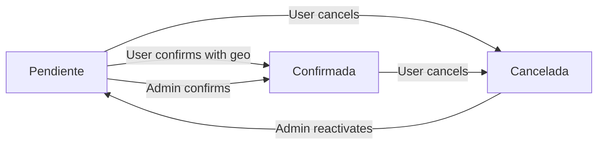

## Overview

The admin panel is a unified dashboard for managing reservations. Regular users see their own bookings, while administrators have full visibility into all reservations across the system with advanced management capabilities.

## User vs. Administrator Views

<CardGroup cols={2}>
  <Card title="Regular User" icon="user">
    - View personal reservations
    - Confirm own pending reservations (with geolocation)
    - Cancel own reservations
    - Filter and search own bookings
  </Card>
  <Card title="Administrator" icon="user-shield">
    - View ALL reservations system-wide
    - Manually confirm ANY reservation (bypass geolocation)
    - Cancel any reservation
    - Reactivate cancelled reservations
    - Access advanced filtering and search
  </Card>
</CardGroup>

<Info>
Administrator status is determined by document number. Users with IDs `1028783377` or `1019096266` have admin privileges.
</Info>

## Dashboard Layout

### Left Sidebar: User Profile

Displays:
- Profile photo or placeholder
- Personalized greeting: "¡Hola, [FirstName]!"
- Job title (cargo) and department (área)
- User role badge: "Administrador" or "Usuario"

**Quick stats panel**:
- **Pendientes**: Count of pending reservations
- **Confirmadas**: Count of confirmed reservations
- **Canceladas**: Count of cancelled reservations
- **Total**: All reservations

### Location Status (Regular Users)

Non-admin users see a geolocation status card:

```
Confirmación por ubicación
• Estás dentro del perímetro (45 m)
  [or]
• Para confirmar, debes estar dentro del perímetro de 100 m

[Actualizar ubicación]
```

<Note>
The "Actualizar ubicación" button refreshes your GPS position to check if you're within the allowed radius for confirmation.
</Note>

### Admin Permissions Notice

Administrators see:

```
Permisos de administrador
Puedes ver todas las reservas y confirmar manualmente 
cualquier reserva pendiente, incluso fuera de la ventana 
de 25 minutos.
```

## Reservation Table

### View Toggle

Switch between:
- **Reservas de hoy**: Only today's reservations
- **Ver todas** / **Ver todas mis**: All historical reservations

### Admin Tabs

Administrators have additional filtering:

<Tabs>
  <Tab title="Todas">
    Shows all reservations in the system regardless of owner.
  </Tab>
  <Tab title="Mis reservas">
    Filters to show only reservations made by the admin.
  </Tab>
  <Tab title="Otras">
    Shows reservations made by other users.
  </Tab>
</Tabs>

### Filters and Search

**Filter by state**:
- Todos los estados
- Pendiente
- Confirmada
- Cancelada

**Filter by room**:
- Todas las salas
- [Individual rooms if multiple rooms exist]

**Search functionality**:
- Search by reservation ID (#12345)
- Search by user name (admin only)
- Search by document number (admin only)
- Search by workstation number

<Info>
Combine multiple filters for precise results. Click "Limpiar filtros" to reset all filters at once.
</Info>

## Reservation Table Columns

### Desktop View

| Column | Description |
|--------|-------------|
| **ID** | Reservation number with monospace badge |
| **Usuario** | User name and document number (admin only) |
| **Fecha** | Reservation date with calendar icon |
| **Sala / Escritorio** | Room name and workstation number |
| **Turno** | Time slot (Mañana, Tarde, Día completo) |
| **Estado** | Status badge (Pendiente/Confirmada/Cancelada) |
| **Motivo** | Cancellation or management reason |
| **Acción** | Confirm/Cancel/Reactivate buttons |

### Mobile View

Reservations display as collapsible cards showing:
- Workstation number and status at a glance
- Reservation ID badge
- Expandable details with user info, date, time slot
- Action buttons (Confirmar, Cancelar)

<Note>
Mobile cards use chevron icons to indicate expanded/collapsed state for better touch interaction.
</Note>

## Reservation Actions

### Confirming Reservations

<Steps>
  <Step title="Check confirmation eligibility">
    **Regular users**: Must be within geolocation radius AND within the 25-minute verification window.
    
    **Administrators**: Can confirm ANY pending reservation at any time, bypassing all restrictions.
  </Step>

  <Step title="Click Confirmar button">
    The button is:
    - **Enabled (green)**: Confirmation allowed
    - **Disabled (grey)**: Outside window or too far from location
  </Step>

  <Step title="Wait for verification">
    The system:
    - Checks geolocation (users only)
    - Validates time window (users only)
    - Updates reservation status to "Confirmada"
    - Logs verification data
  </Step>

  <Step title="Review confirmation">
    Status badge changes to green "Confirmada"
    
    Motivo field shows:
    - "Reserva confirmada por geolocalización." (user)
    - "Reserva confirmada por administrador." (admin)
  </Step>
</Steps>

#### Confirmation Time Indicators

For pending reservations, users see:
- **"Quedan 23 min para confirmar"**: Active window countdown
- **"La ventana de confirmación no está activa"**: Window closed or not yet open
- **"Pendiente de confirmación"**: Generic pending state

Administrators see:
- **"Confirmación manual disponible para administrador."**: Always available

### Cancelling Reservations

<Steps>
  <Step title="Click the Cancelar button">
    A confirmation modal appears requesting cancellation details.
  </Step>

  <Step title="Enter cancellation reason">
    The "Motivo de cancelación" textarea is **required**. You must provide a reason before proceeding.
  </Step>

  <Step title="Confirm cancellation">
    Click "Aceptar" to finalize. The modal shows reservation details for verification:
    
    ```
    Escritorio 3 · 2026-03-14
    ```
  </Step>

  <Step title="Status update">
    - Reservation status → "Cancelada"
    - Estado field set to `false`
    - Cancellation reason stored in `motivo_cancelacion`
    - Verification metadata logged
  </Step>
</Steps>

<Warning>
Cancelled reservations cannot be confirmed again by regular users. Only administrators can reactivate them.
</Warning>

### Reactivating Reservations (Admin Only)

<Note>
Only administrators can reactivate cancelled reservations.
</Note>

**Reactivation process**:

1. Find a cancelled reservation (red "Cancelada" badge)
2. Click the **Reactivar** button (gold/amber styling)
3. System updates:
   - Status → "Pendiente"
   - Estado → `null`
   - Clears `motivo_cancelacion`
   - Logs reactivation in verification metadata

**Verification metadata**:
```json
{
  "fecha": "2026-03-14T16:00:00.000Z",
  "mensaje": "Reserva reactivada por administrador.",
  "tipo": "reactivacion-admin",
  "autorizadaPor": "1028783377",
  "nombreAutorizador": "Admin Name"
}
```

## Reservation Status Workflow



### Status Indicators

<CardGroup cols={3}>
  <Card title="Pendiente" icon="clock">
    **Color**: Yellow (#FFF3CD)  
    Awaiting geolocation confirmation within time window
  </Card>
  <Card title="Confirmada" icon="circle-check">
    **Color**: Green (#D4EDDA)  
    User verified attendance; reservation active
  </Card>
  <Card title="Cancelada" icon="circle-xmark">
    **Color**: Red (#F8D7DA)  
    Cancelled by user or auto-cancelled for no-show
  </Card>
</CardGroup>

## Real-Time Updates

The panel uses a real-time sync hook (`useRealtimeSync`) to automatically refresh when:

- New reservations are created
- Existing reservations are confirmed
- Reservations are cancelled
- Any reservation status changes

<Info>
The custom event `working-reservas-updated` triggers automatic data refresh across all open panel instances.
</Info>

## Location Tracking

For regular users, the panel continuously monitors:

### Distance Display

```
Estás dentro del perímetro (45 m).
```

Shows your current distance from the workplace center point.

### Refresh Button

**"Actualizar ubicación"** button:
- Requests fresh GPS position
- Recalculates distance
- Updates "within radius" status
- Enables/disables confirm buttons accordingly

<Warning>
If geolocation fails, you'll see: "No fue posible obtener tu ubicación." Check browser permissions and GPS settings.
</Warning>

## Data Normalization

The panel normalizes reservation data from the Strapi API:

- Extracts workstation ID from relations
- Resolves time slot (horario) information
- Maps room/sala relationships
- Converts estado boolean to text status
- Formats dates for Colombian locale (es-CO)

**Example normalized reservation**:
```javascript
{
  id: 123,
  nombre: "Juan Pérez",
  nombreCompleto: "Juan Carlos Pérez Gómez",
  documento: "1028783377",
  area: "Tecnología",
  fecha: "2026-03-14",
  estado: "Confirmada",
  puestoId: 3,
  salaId: 1,
  salaNombre: "Sala Principal",
  horarioId: 1,
  turnoLabel: "Mañana"
}
```

## Navigation Actions

- **Panel button**: Refresh current panel view
- **Logout button**: Sign out and return to login
- **Back button**: Return to previous page

## Error Handling

### Loading State

```
Cargando reservas…
```

Displayed while fetching data from the API.

### Error State

```
Error al cargar las reservas.
[Reintentar]
```

Shows if API request fails. Click "Reintentar" to retry.

### Empty State

**No reservations**:
```
No hay reservas para hoy.
```

**No matches after filtering**:
```
No hay reservas que coincidan con los filtros.
```

## Best Practices

### For Regular Users

1. **Enable location before arrival**: Allow browser location permissions in advance
2. **Check time windows**: Know when your verification window opens (typically 25 min before shift)
3. **Arrive early**: Be within 100m radius before your confirmation window closes
4. **Provide cancellation reasons**: Always explain why you're cancelling for transparency

### For Administrators

1. **Use search and filters**: Quickly find specific reservations among hundreds
2. **Manual confirmation**: Help users who have geolocation issues
3. **Monitor patterns**: Use the "Otras" tab to see organizational usage trends
4. **Reactivate sparingly**: Only reactivate when cancellations were mistakes
5. **Document actions**: Provide clear messages when manually confirming

<Note>
Administrators should use manual confirmation power responsibly. The geolocation system ensures fair space usage and prevents abuse.
</Note>

## Keyboard and Accessibility

- Table rows highlight on hover for better visibility
- All buttons have descriptive `title` and `aria-label` attributes
- Modal dialogs trap focus for keyboard navigation
- Search input supports standard keyboard input
- Mobile cards use native touch interactions

## Integration Points

The admin panel integrates with:

- **[Room Selection](/features/room-selection)**: Navigate back to make new reservations
- **[Reservations](/features/reservations)**: View bookings created through the reservation flow
- **[Attendance Verification](/features/attendance-verification)**: Confirm reservations with geolocation
- **Strapi API**: Fetches and updates reservation data via REST endpoints